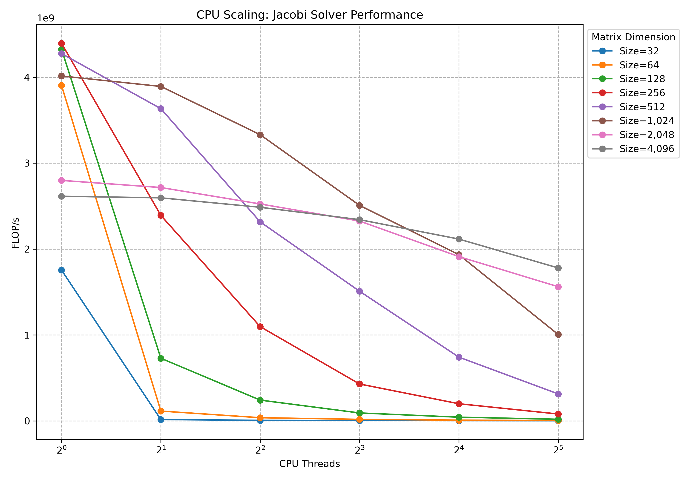
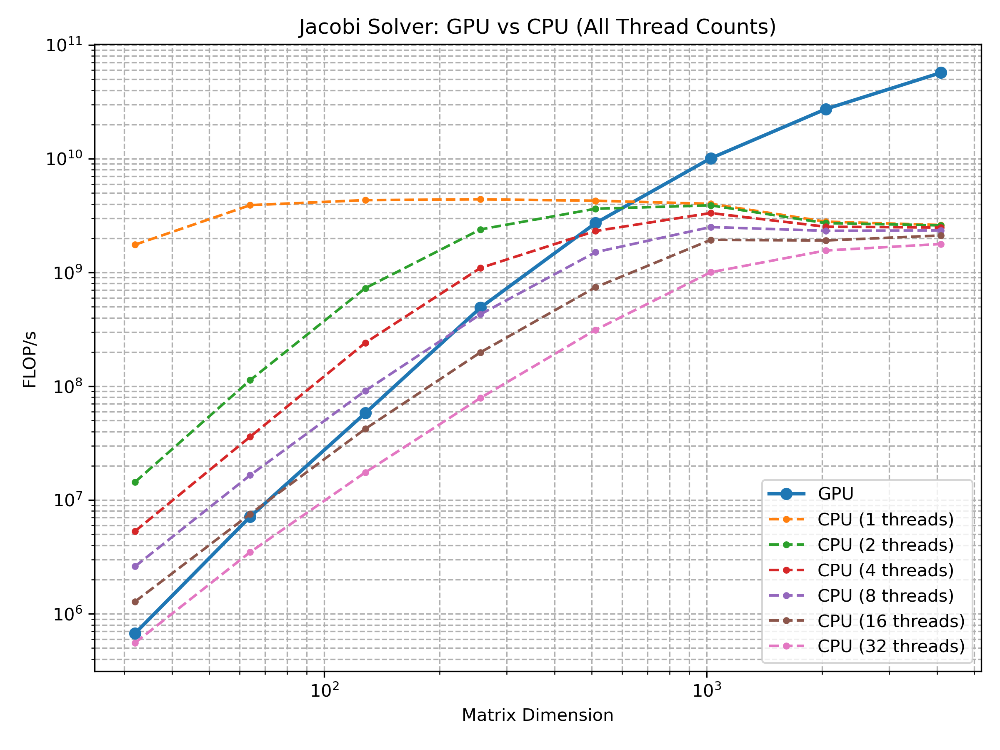
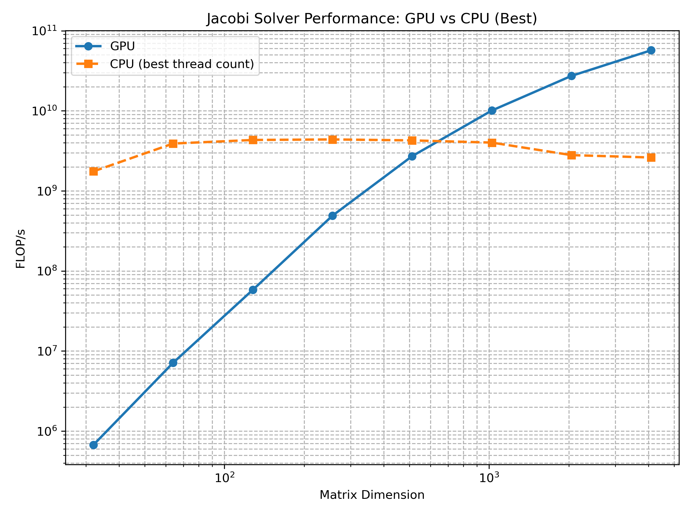
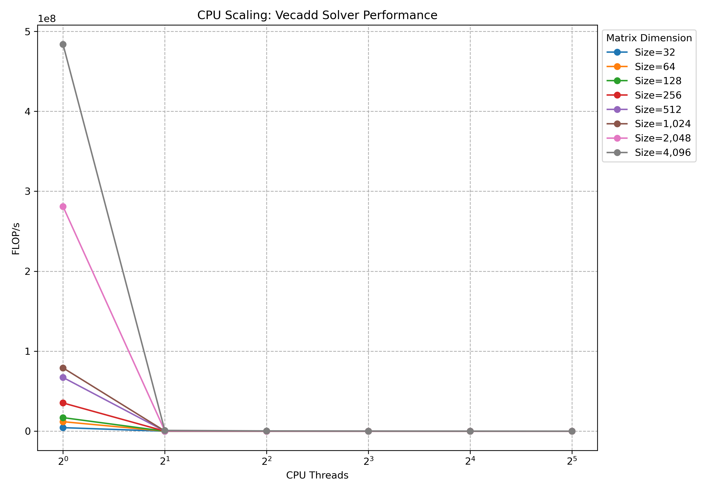
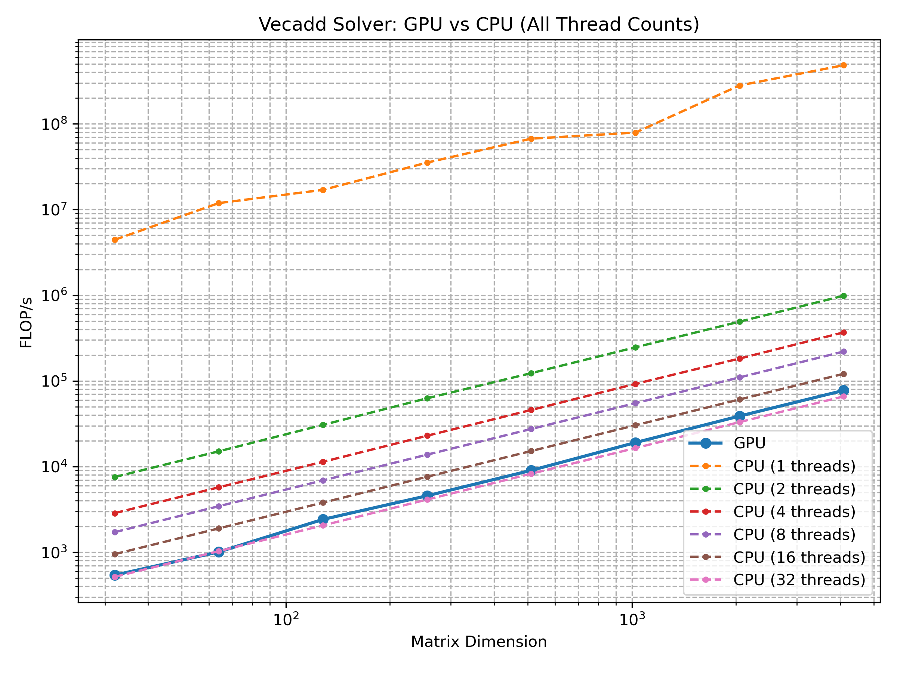
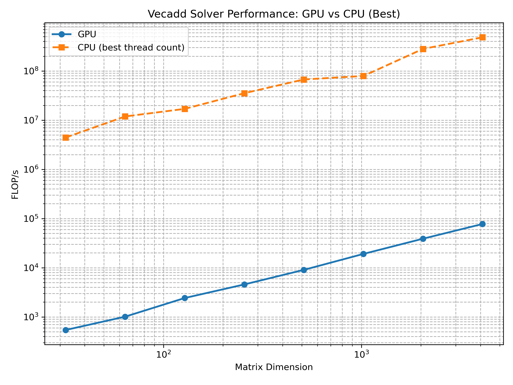

# Performance Report: Vecadd and Jacobi Solver

## Jacobi Solver - CPU Scaling

## Jacobi Solver - GPU vs CPU (All Threads)

## Jacobi Solver - GPU vs CPU (Best)

## Vecadd Solver - CPU Scaling

## Vecadd Solver - GPU vs CPU (All Threads)

## Vecadd Solver - GPU vs CPU (Best)

## Performance Analysis

### Vecadd Solver Analysis

- **CPU Scaling**: For Vecadd, performance gains from multi-threading are minimal or even detrimental, likely due to low arithmetic intensity and thread overhead outweighing benefits.
- **GPU vs CPU**: The GPU lags behind CPU significantly. Since vector addition is memory-bound and has little computation, the overhead of offloading dominates.

### Jacobi Solver Analysis

- **CPU Scaling**: Moderate matrix sizes (512–1024) benefit from multi-threading. However, for small matrices (≤128), thread overhead and cache effects reduce performance.
- **GPU vs CPU**: The GPU outperforms the CPU by orders of magnitude for larger matrices (>1024). This reflects GPU's ability to exploit massive parallelism and memory bandwidth.
- **Crossover Point**: Around matrix size 1024, GPU begins to significantly outperform even the best CPU configuration.
