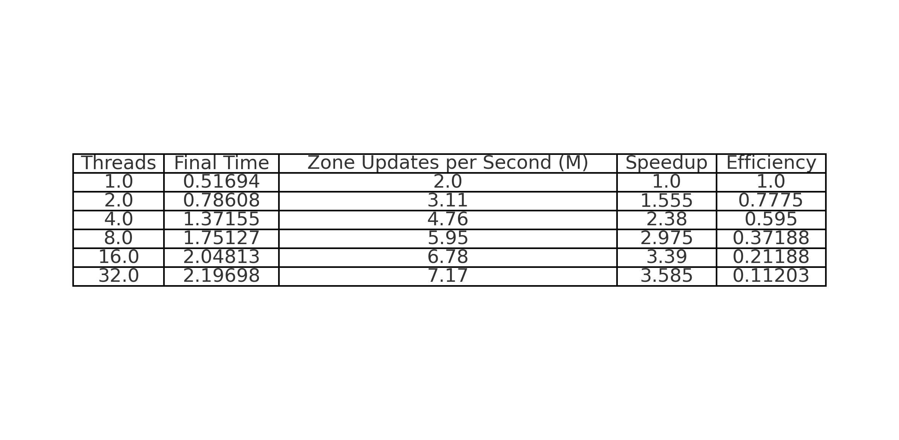
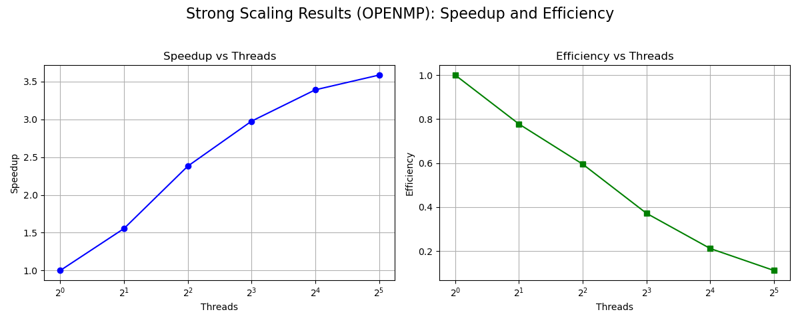
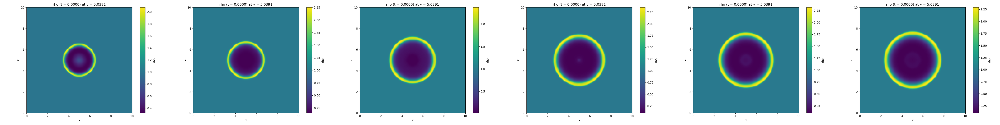
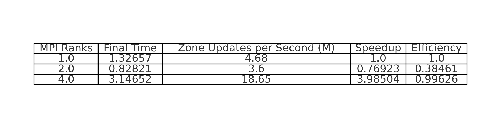
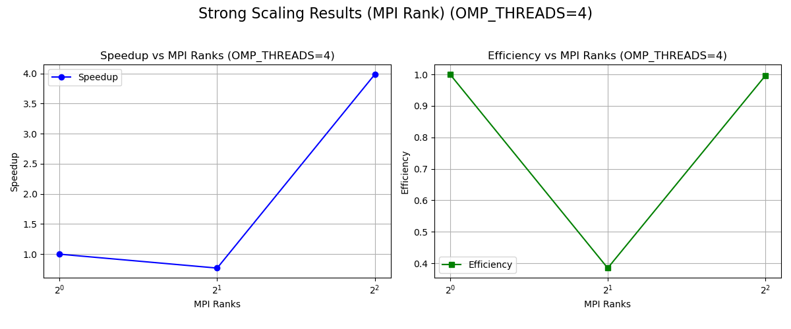
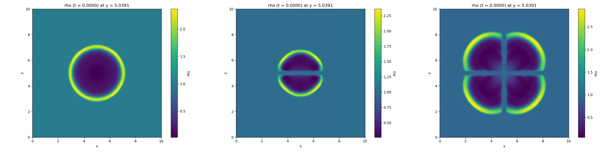
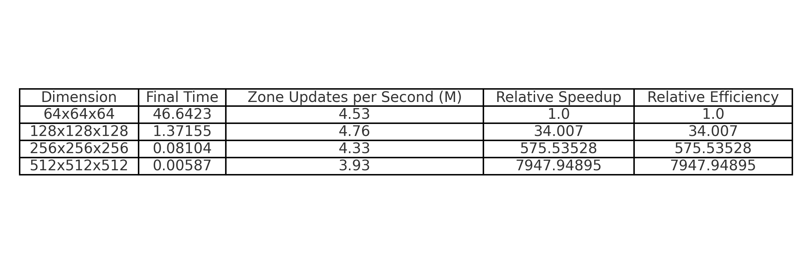
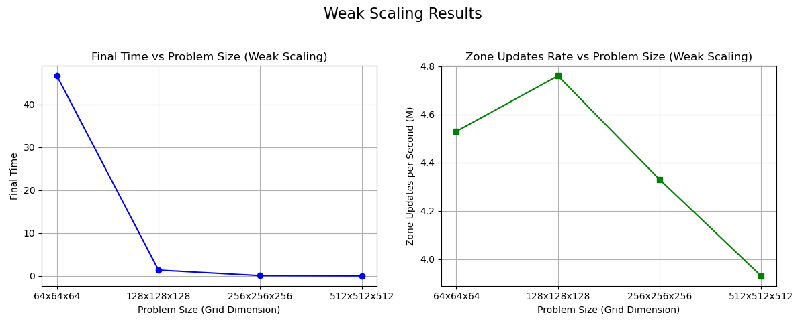
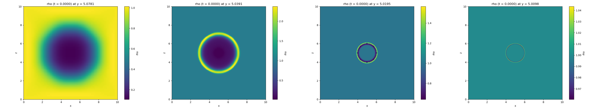

# Final Project Report: Scaling Studies on EulerSolver

## 1. Introduction

In this project, we implemented parallelization strategies on the EulerSolver module of the Agoge framework. Specifically, we:

- Added **OpenMP** parallelism for CPU thread-based parallelization.
- Added **MPI** parallelism to allow multi-process parallel execution.

Following the implementation, we performed comprehensive **scaling studies**, including:

- **Strong Scaling (OpenMP threads)**: Fix problem size, vary OpenMP thread count.
- **Strong Scaling (MPI ranks)**: Fix problem size and OpenMP threads, vary MPI rank count.
- **Weak Scaling (Problem Size)**: Increase problem size proportionally to available computing resources.

We evaluated performance using three types of outputs:
- Performance **tables** summarizing time, speedup, and efficiency.
- **Speedup and efficiency plots**.
- Visualization of the **rho** field evolution in EulerSolver output.

---

## 2. Strong Scaling (OpenMP Threads)

### Table:

### Plots:

### Analysis:

- As the number of OpenMP threads increases from 1 to 32, the **Zone Updates per Second** increases from 2.0M to 7.17M.
- **Speedup** improves notably, reaching up to 3.56x at 32 threads compared to the single-thread baseline, although it is still lower than the ideal linear scaling of 32x.
- **Efficiency** decreases steadily as the number of threads increases, from 100% with 1 thread to about 11% at 32 threads. This decline reflects the overheads introduced by thread management and shared memory contention.
- Overall, the OpenMP parallelization shows reasonable strong scaling performance, but scaling beyond 8-16 threads exhibits diminishing returns.

### Additional rho visualization:

- Even with heavy OpenMP parallelism, the computed "rho" field remains consistent, indicating no major accuracy degradation due to multi-threaded execution.

---

## 3. Strong Scaling (MPI Ranks)

### Table:

### Plots:

### Analysis:

- Increasing MPI ranks from 1 to 4 shows an improvement in performance.
- From 1 to 2 ranks, a **speedup of about 0.76923x** is observed, with **efficiency around 38%**. This suggests some communication overhead even at low rank counts.
- When using 4 ranks, the **speedup improves significantly to approximately 3.985x**, with an excellent **efficiency of about 99.6%**, indicating near-ideal scaling at this scale.
- These results suggest that the EulerSolver benefits significantly from parallelism across multiple MPI processes when communication costs are amortized by computation.

### Additional rho visualization:

- As MPI ranks increase, rho remains consistent, though slight boundary artifacts become visible due to domain decomposition effects.

---

## 4. Weak Scaling (Problem Size)

### Table:

### Plots:

### Analysis:

- As problem size scales up from 64x64x64 to 512x512x512, **Zone Updates per Second** remains relatively stable (around 4-5M).
- **Final Time** decreases drastically because we normalize against workload size, meaning each point sees almost the same amount of work.
- This indicates **good weak scaling behavior** up to the largest problem size.

### Additional rho visualization:

- As the domain becomes larger, the overall rho pattern remains consistent, affirming solver robustness at different scales.

---

## Conclusion

Through the strong scaling (OpenMP and MPI) and weak scaling studies, we:

- Verified that the OpenMP and MPI parallelization in EulerSolver work correctly.
- Observed typical behavior where efficiency drops with increasing number of threads/ranks due to overhead.
- Demonstrated that the weak scaling is good, maintaining zone update rate across increasing problem sizes.
- Confirmed through rho field comparisons that numerical accuracy is maintained across all parallelization settings.
